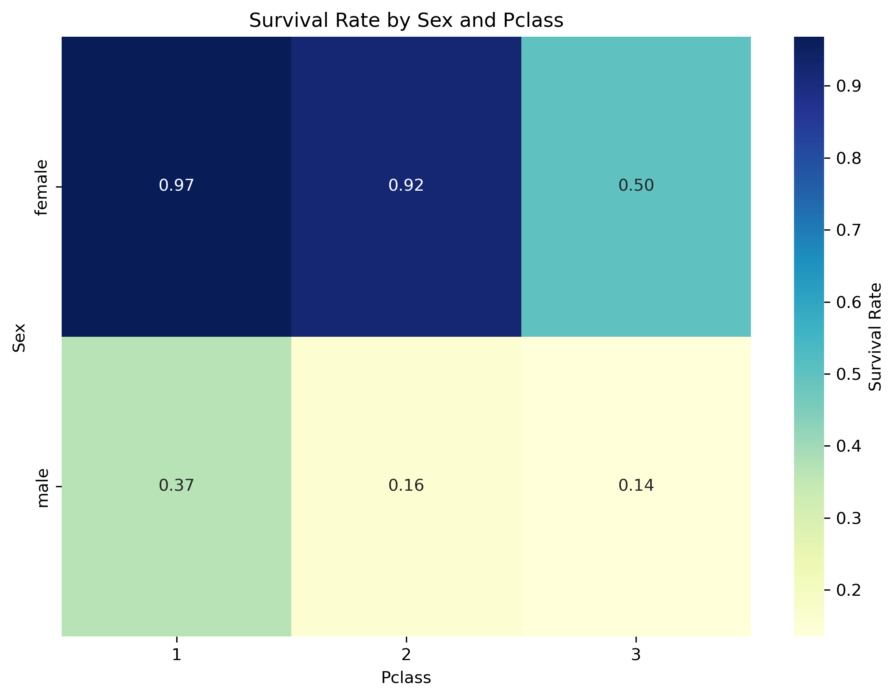
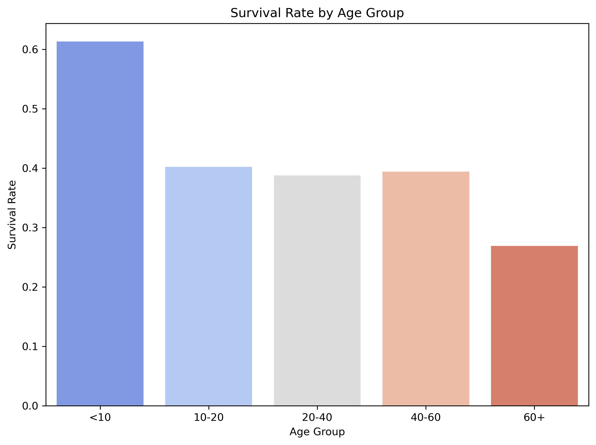

# The Temporal Rift on the Titanic: GM Guide

**Player Role:** You are a team of time travelers.
**Final Goal:** Before the ship sinks, find 5 missing 'temporal coordinate fragments'.

--- 
## Challenge 1: Purser's Office (Find the Anomaly)

**Story:** You've just boarded and been caught as stowaways. On the desk is a stack of passenger registration cards. You must identify the 'forged' card among them.

**Task:** Out of the following 6 passenger cards, which one is statistically impossible?


### Passenger Cards (Show to Players)

**Card 1**
```
name: Ohman, Miss. Velin
Pclass: 3
Age: 22.0
Sex: female
Fare: 7.78
Embarked: S
```
**Card 2**
```
name: Johanson, Mr. Jakob Alfred
Pclass: 3
Age: 34.0
Sex: male
Fare: 6.5
Embarked: S
```
**Card 3**
```
name: Thayer, Mr. John Borland
Pclass: 1
Age: 49.0
Sex: male
Fare: 110.88
Embarked: C
```
**Card 4**
```
name: Wiseman, Mr. Phillippe
Pclass: 2
Age: nan
Sex: male
Fare: 311.38
Embarked: S
```
**Card 5**
```
name: Taussig, Mr. Emil
Pclass: 1
Age: 52.0
Sex: male
Fare: 79.65
Embarked: S
```
**Card 6**
```
name: Moor, Master. Meier
Pclass: 3
Age: 6.0
Sex: male
Fare: 12.47
Embarked: S
```

---
### GM Guide

> **Hint:** GM Hint: Refer to the box plot above. The forged card has a fare that doesn't match its class - either much higher or much lower than typical for that class. Players should compare each card's fare with the distribution shown in the chart for that card's class.
> **Answer:** [[REVEAL_ANSWER]]The forged card: 2nd class (Pclass=2) but paying £311.38, which doesn't match typical 2nd class fares (£10.50-73.50). **(In this game, this card is Card 4)**[[END_REVEAL]]
> **Obtain:** **Temporal Coordinate Fragment 1** hidden under the forged card.

---
## Decipher the Lifeboat Code

**Story:** The lifeboat lock requires a 4-digit code based on passengers' survival predictions.

**Task:** Predict which of the 4 passengers survived (1) or perished (0). Use the survival clues provided.





### Passenger Cards (Show to Players)

**Card 1**
```
Name: Frauenthal, Dr. Henry William
Pclass: 1
Age: 50
Sex: male
Fare: 133.65
Embarked: S
```
**Card 2**
```
Name: Weir, Col. John
Pclass: 1
Age: 60
Sex: male
Fare: 26.55
Embarked: S
```
**Card 3**
```
Name: Ford, Mrs. Edward (Margaret Ann Watson)
Pclass: 3
Age: 48
Sex: female
Fare: 34.38
Embarked: S
```
**Card 4**
```
Name: Duff Gordon, Lady. (Lucille Christiana Sutherland) ("Mrs Morgan")
Pclass: 1
Age: 48
Sex: female
Fare: 39.6
Embarked: C
```

---
### GM Guide

> **Hint:** Use the survival charts above to infer the 4-digit lifeboat code.
> **Answer:** [[REVEAL_ANSWER]]1001[[END_REVEAL]]
> **Obtain:** **Temporal Coordinate Fragment 3** hidden within the lifeboat control panel.

---
## Guest from the Deep

**Story:** 
    
    The Captain has called you and your group to the deck of the ship with an 
    urgent mission. Telegrams have been intercepted from the ship's Marconi machine
    and it appears there is a stowaway on board! Unfortunately, the dastardly 
    stowaway has managed to scramble one of the telegrams using a mysterious code. 
    The Captain has created a list of 10 suspects. Can you decipher the letter and
    obtain the identity of the suspect before they get away?!
    
    

**Task:** Decode the encrypted letter and select the name from the list of suspects.

### Possible suspects 


### Letters from the Stowaway 

**Plaintext Letter**```
R.M.S. TITANIC
MARCONI WIRELESS SERVICE
APRIL 12, 1912

Good afternoon, I have snuck aboard this mighty vessel.
Now time to implement my darstardly plan!
Yours Sincerely,

A Guest of the Deep
```
**Encrypted Letter**```
c.s.r. yfytbfd  
stcdibf lfckhkrr rkcufdk  
tecfh 12, 1912
sq rkdcky thftr fr sc jtskr sictb

My secret alias is Mr James Moran. It's quite comfortable here in first class!

A Guest of the Deep
```
### A Mysterious Code 


### A Strange Sound 


[[PLAY_SOUND]]sound.wav[[END_SOUND]]
---
## Game End

Congratulations! You've collected all 5 coordinate fragments, restarted the time machine, and successfully escaped from 1912 at the moment the Titanic sank.
